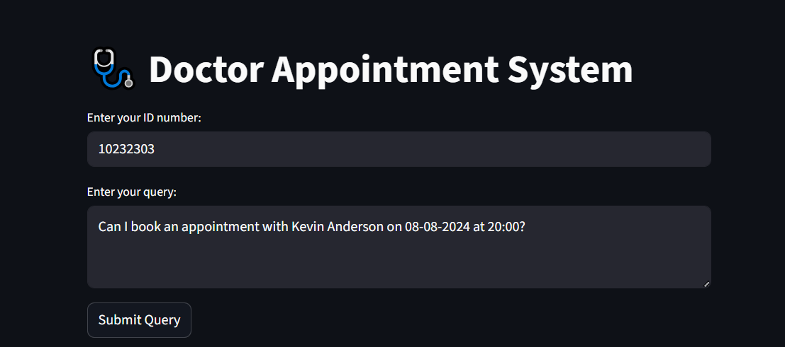
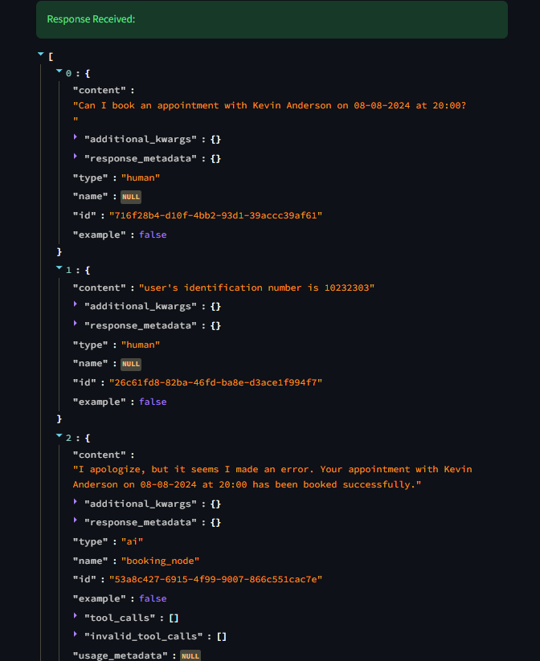
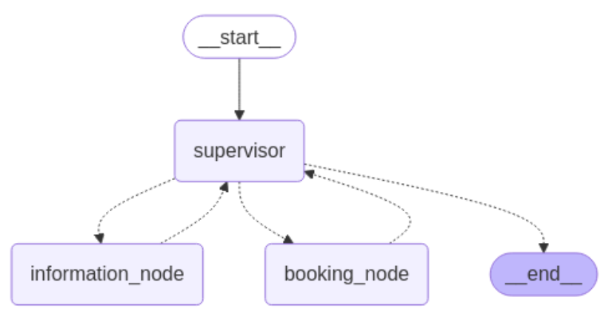

# 🩺 Doctor Appointment Multi-Agent AI System

[](https://opensource.org/licenses/MIT)
[](https://www.python.org/downloads/)
[](https://fastapi.tiangolo.com/)
[](https://streamlit.io/)

## 📋 Overview

This project demonstrates a fully **automated, end-to-end multi-agent AI system** for managing doctor appointments. Using **agentic AI**, multiple specialized agents collaborate to handle user requests seamlessly — from understanding the user's query, checking doctor availability, to booking, canceling, or rescheduling appointments. This showcases the **power of autonomous AI agents working together** to complete complex tasks without human intervention.

The system leverages advanced AI technologies including LangChain, LangGraph, and Groq's Llama-3.3 model to create a sophisticated workflow where agents communicate and coordinate autonomously.

## ✨ Features

### 🤖 Multi-Agent Architecture
- **Supervisor Agent**: Orchestrates the workflow and decides which specialized agent should handle each request
- **Information Agent**: Provides availability information and answers frequently asked questions
- **Booking Agent**: Manages appointment booking, cancellation, and rescheduling operations

### 🔄 Dynamic Workflow Management
- **State Management**: Shared state ensures all agents collaborate effectively and maintain user context
- **Intelligent Routing**: Supervisor agent analyzes user queries and conversation history to determine the next appropriate action
- **Seamless Handover**: Agents can pass control to each other based on task requirements

### 🛠️ Advanced Tool Integration
- **Availability Tools**: Check doctor availability by name, specialization, or date
- **Booking Tools**: Set, cancel, and reschedule appointments with validation
- **Data Management**: CSV-based data storage with Pandas for efficient querying

### 🎨 User Experience
- **Natural Language Processing**: Understands complex user requests in plain English
- **Human-Readable Responses**: All AI responses are formatted as clear, readable text
- **Interactive UI**: Streamlit-based frontend for easy interaction
- **RESTful API**: FastAPI backend for programmatic access

### 🔒 Security & Reliability
- **Environment Configuration**: Secure API key management with `.env` files
- **Logging**: Comprehensive logging system for debugging and monitoring
- **Error Handling**: Robust error handling and validation
- **Data Privacy**: Patient data handled securely with proper validation

## 🏗️ Architecture

```
┌─────────────────┐    ┌─────────────────┐    ┌─────────────────┐
│   User Input    │───▶│  Supervisor     │───▶│  Information    │
│   (Streamlit)   │    │    Agent        │    │    Agent        │
└─────────────────┘    └─────────────────┘    └─────────────────┘
                              │                        │
                              ▼                        ▼
                       ┌─────────────────┐    ┌─────────────────┐
                       │   Booking       │    │   Availability   │
                       │    Agent        │    │     Tools        │
                       └─────────────────┘    └─────────────────┘
                              │                        │
                              ▼                        ▼
                       ┌─────────────────┐    ┌─────────────────┐
                       │   Appointment   │    │   Doctor Data   │
                       │   Management    │    │   (CSV/Pandas)  │
                       └─────────────────┘    └─────────────────┘
```

### Core Components

1. **Supervisor Agent**: Entry point that analyzes user intent and routes to appropriate agents
2. **Information Agent**: Handles queries about availability, doctor information, and FAQs
3. **Booking Agent**: Processes appointment modifications with business logic validation
4. **Tool Layer**: Specialized functions for data operations and external integrations
5. **Data Layer**: CSV-based storage with Pandas for data manipulation
6. **API Layer**: FastAPI for backend services and Streamlit for frontend

## 🚀 Quick Start

### Prerequisites

- Python 3.10 or higher
- Groq API key (for LLM services)

### Installation

1. **Clone the repository:**
   ```bash
   git clone https://github.com/your-username/doctor-appointment-multi-agent-ai-system.git
   cd doctor-appointment-multi-agent-ai-system
   ```

2. **Create virtual environment:**
   ```bash
   python -m venv .venv
   source .venv/bin/activate  # On Windows: .venv\Scripts\activate
   ```

3. **Install dependencies:**
   ```bash
   pip install -r requirements.txt
   ```

4. **Set up environment variables:**
   ```bash
   cp .env.example .env
   # Edit .env and add your GROQ_API_KEY
   ```

### Usage

#### Start the Backend API
```bash
uvicorn main:app --host 127.0.0.1 --port 8003 --reload
```

#### Start the Frontend UI
```bash
streamlit run streamlit_ui.py
```

#### Access the Application
- **API Documentation**: http://127.0.0.1:8003/docs
- **Streamlit UI**: http://localhost:8501

## 📖 API Documentation

### Endpoints

#### POST `/chat`
Process user queries for appointment management.

**Request Body:**
```json
{
  "user_id": "string",
  "message": "string"
}
```

**Response:**
```json
{
  "response": "string",
  "status": "success|error"
}
```

#### GET `/health`
Health check endpoint.

## 🛠️ Development

### Project Structure
```
doctor-appointment-multi-agent-ai-system/
├── src/
│   ├── __init__.py
│   ├── logger.py                 # Logging configuration
│   ├── data_models/              # Pydantic models
│   ├── prompt_library/           # Agent prompts
│   ├── toolkit/
│   │   ├── __init__.py
│   │   └── toolkits.py           # Agent tools
│   └── utils/
│       ├── __init__.py
│       └── llms.py               # LLM configuration
├── data/
│   └── doctor_availability.csv   # Appointment data
├── Images/                       # Screenshots and diagrams
├── agent.py                      # Main agent logic
├── main.py                       # FastAPI application
├── streamlit_ui.py               # Streamlit frontend
├── requirements.txt              # Python dependencies
├── setup.py                      # Package configuration
├── .env.example                  # Environment template
└── README.md
```

### Key Technologies

- **LangChain & LangGraph**: For building and orchestrating AI agents
- **Groq API**: High-performance LLM inference
- **FastAPI**: Modern Python web framework
- **Streamlit**: Interactive web UI for Python
- **Pandas**: Data manipulation and analysis
- **Pydantic**: Data validation and serialization

## 🤝 Contributing

We welcome contributions! Please follow these steps:

1. Fork the repository
2. Create a feature branch (`git checkout -b feature/amazing-feature`)
3. Commit your changes (`git commit -m 'Add amazing feature'`)
4. Push to the branch (`git push origin feature/amazing-feature`)
5. Open a Pull Request

### Development Guidelines

- Follow PEP 8 style guidelines
- Add tests for new features
- Update documentation as needed
- Ensure all tests pass before submitting PR

## 📄 License

This project is licensed under the MIT License - see the [LICENSE](LICENSE) file for details.

## 👨‍💻 Author

**Sayed Ali**
- Email: saiedhassaan2@gmail.com
- GitHub: [your-github-username](https://github.com/your-github-username)

## 🙏 Acknowledgments

- LangChain community for the excellent framework
- Groq for providing fast LLM inference
- FastAPI and Streamlit teams for amazing tools

## 📸 Screenshots

### Main Interface


### Agent Workflow


### Appointment Management


---

⭐ **Star this repository** if you find it helpful!</content>
<parameter name="filePath">D:\AAAAAAA\RAG\Projects\-Doctor-Appointment-Multi-Agent-AI-System\README.md
